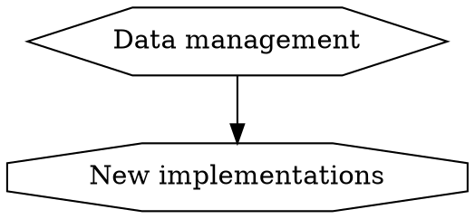
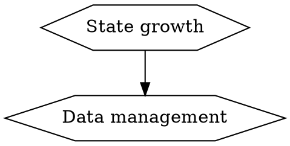

# Ethereum 1x Definition

## Objective
This document aims to define and describe the Ethereum 1x initiative, with a primary goal of being used as a guide for funding and other support that various improvement proposals and projects should receive under the auspices of Ethereum 1x.

## Methodology and terminology
For the purpose of this analysis, we view Ethereum as a set of interacting agents. Their interaction is described by the concepts of contributions and challenges.
Ethereum system itsef is an emergent entity, and only exists as long as its crucial actors keep making their contributions. The goal of the Ethereum 1x as an initiative, is to preserse and improve the "wellfare" of this emergent entity, rather than any agents specifically.
### Agents
Agents make contributions and thus, collectively, give rise to the Ethereum system. Their contributions also give the Etherum system its properties, such as resilience, efficiency, accessibility. Agents are shown as ellipses.

### Contributions
We attempt to enumerate the most valuable and crucial contributions of the agents to the Ethereum system.

### Challenges
Challenges (how critical they are, i.e. if the challenge is not met, will agents's contribution degrade or stop?) that agents face. Shown as octagons.

### Causes
We try to understand the main causes of each challenge. Where it adds to understanding, we talk about sub-causes

### Solutions
Proposed solutions should be targeted at the causes but may have side-effects (some solutions may be causes for other challenges, though perhaps less critical than the ones they are trying to address)

## Agents
For the purpose of this document, we will consider a somewhat coarse-grained grouping of Ethereum agents. In the later revisions of the document, the grouping can be expanded or made more fine-grained.

Each agent type makes certain contributions to the wellfare of the Ethereum system, and, in turn faces challenges. If these challenges become too great, then the contribution reduces or stops, and the Ethereum system suffers or potentially ceases to exist.
## End users (agent)
End users generally contribute "usage" to the system. Some usage is directly beneficial, as it brings more resources into the system (for example, purchasing Ether), some - only indirectly (intense usage attract more users).
End users are mostly concerned with lack of use cases, transactional cost of using Ethereum dapps or Ether currency, as well as the safety of their funds and data.

### Lack of use cases (challenge)
We assume that there are users that would have interacted with the Ethereum system (and contribute to it) if there were use cases for them. Such use cases need to be discovered and tried for the users to keep contributing.
### Cost of transactions (challenge)
By cost of transactions for the end user we normally understand the gas cost of those transactions multiplied by the current cost of gas. Users may often overpay for gas because they cannot reliably predict which gas price level will ensure the inclusion of their transactions with required urgency.
### Risk assessment (challenge)
Often users need to weight risk of exploit against the benefit they hope to get from the transaction. Initial design of Ethereum did not put a lot of emphasys on making that risk assessment easier.
## Node operators (agent)
Cost of operating a full node is rising. Below are the main cost categories.

### High end storage devices (challenge)
All main-net capable implementations require at least SSD to maintable acceptable operating speed, and NVMe is desirable for a initial sync (downloading all the blocks and reconstituting the current state of the blockchain).
### Internet traffic (challenge)
After initial sync, traffic usage should not be very high. However, if many new nodes joining the network, the outgoing traffic of the incument nodes may increase, to serve blocks and initial state to the new-joiners.
### DevOps (challenge)
Ethereum nodes transmit, process, and store large amounts of data. They also often have very little tolerance to downtime. These two characteristics mean that management of Ethereum nodes can be non-trivial.

## Dapp developers (agent)
Dapp developers are mainly concerned with two issues: scalability and security. For some potential dapps, Ethereum as a platform does not provide enough capacity in terms of transactional throughput, cost of transactions, capacity of data retention.
These two issued can be thought of mirroring the issues facing the end users. Higher scalability correlates to the lower cost for users. Better security measures for smart contracts translate to easier risk assessment for the users.

### Scalability (challenge)
Some use cases of smart contracts and currency require certain level of scalability, which usually translates to how quickly a transaction gets "confirmed" related to how high gas price is paid. If scalability of the system is not enough, some more complex constructions (e.g. Level 2 solutions like state channels and Plasma) might need to be employed, at the cost of increased complexity.

### Security (challenge)
Whenever users' interaction with the Ethereum system are less trivial than currency transfer, some security analysis is usually performed, to demonstrate to the potential users of smart contracts that most likely their transactions will not have unintended consequences. So far the tradition is that the additional cost of performing security audits of the code, or formal verification, or other security measures is paid by the dapp developers.

## Core developers (agent)
Contribuion of core developers is in developing and maintaining the software that, when run on the computers connected to the Internet, gives rise to the Ethereum network.
Development of a fully functional Ethereum implementation which is capable of run on the mainnet is challenging.

#### New implementations (challenge)
It is difficult to create new indepdendent implementations (clients) that are capable of working with the main net. Lack of implementation diversity leads to core developers being "conservative" by default.

#### Data management (cause)
The hardest part of a mainnet capable implementation seems to be data management. Ethereum node needs to transmit, process and store large amounts of data. To do so efficiently, it needs non-trivial techniques. Such techniques, however, are currently not considered in Ethereum specification documents or other literature.

#### Growth of Ethereum state (sub-cause)

#### Product vs system (challenge)
It is difficult to balance product improvements (performance, usability), and the upgrades of Ethereum. Example: preparation for the Istanbul hard fork vs finishing Geth 1.9

#### Backwards compatibility (challenge)
It is difficult to balance backwards compatibility (with the existing contracts), and the rule changes that are neccessary for Ethereum system to be sustainable.

#### Functional coupling (cause)
In the design of Ethereum, there some crucial concepts with double of tripple functions. First example: gas is used as charge for resources, as well as means of restricting callbacks and recursion depth. Second example: nonce of accounts is used for both replay protection and as input for generating of the contract addresses. Third example (though this is a prevalent implementation choice rather than a requirement of the specification): particia merkle tree is used for both defining what the state root hash is, and for storing data. Functional coupling makes the design inflexible and causes issues when something about the concept needs to be changed. For example, changing gas cost of some operations, like reduction for `SSTORE` and increase for `SLOAD` clashes with the concept of call stipend, which is part of the restricting function of gas.

#### Spontaneous voluntary contributions vs Managed development
By "spontaneous voluntary contributions" we understand contributions to core implementation by people who are not explicitely asked to do the work, but decide to do it, because they found it interesting and/or important.
By "managed development" we understand development in the core implementations that are directed by some leadership, according to some implementation plan.
Both ways of development have their pros and cons. It seems that in the current circumstances we mainly rely on the spontaneous voluntary contributions and that seems to leave important gaps and technical debt.
