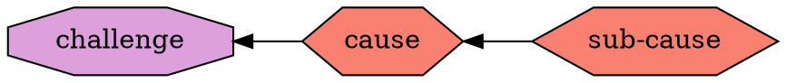
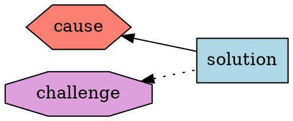

# Ethereum 1x Definition (part 2)

## Methodology (continuation from part 1)
In part 1, we define agents, their contributions to the Ethereum system, and their challenges. This part deals with causes for these challenges, as well as the solution that have been proposed for these causes.

### Causes
We try to understand the main causes of each challenge. Where it adds to understanding, we talk about sub-causes

### Solutions
Proposed solutions should be targeted at the causes but may have side-effects (some solutions may be causes for other challenges, though perhaps less critical than the ones they are trying to address). These side effects are shown as dotted lines.

## Summary of challenges
Here we summarise the challenges we have identified in the part 1.
1. Long time to sync a new node
2. Cost of storage devices
3. High internet traffic
4. Complex DevOps to run nodes
5. Balancing between updating rules of Ethereum and maintaining backwards compatibility
6. Balacing between updating the rules of Ethereum and improving client implementations and 
7. Difficulty of writing new implementations
8. Limited transaction throughput
9. Difficulty of assessing safety of some transactions (to smart contracts)
10. Difficulty in estimating cost of a transaction

## Description of challenges

### Long time to sync a new node
When a new computer joins the Ethereum network, it needs to obtain the current state before it can start processing arbitrary transactions. The current state can be obtained in two main ways.
Firstly, the current state can be computed from the Genesis block, by applying (executing all transactions within) all the blocks in sequence. This method is now computationally hard due to the number of blocks (and transactions in them) to apply, and due to the size of the state.
Secondly, the current state can be downloaded from the peers that already computed (or downloaded) it. This method is not as hard computationally, but it requires a lot of communication with the peers, due to the size and the structure of the state.

### Cost of storage devices
One can divide the persistent data managed by an Ethereum client into two main categories. First category is the data that very rarely changes after being written down. This category includes the content of downloaded block headers, block bodies, transaction receipts. Since chain reorganisations are relatively rare and "shallow" (meaning that not many blocks are getting reverted), one can store these data in an append-only form. This makes it feasible to store such data in a lower-cost devices such as HDD (Hard Disk Drives), or even tape (which is the cheapest storage device at the moment of writing). In fact, the "Freezer" implementation in go-ethereum 1.9 is based on these observations.
Second category is the data that is expected to change constantly. This includes mostly the active state of Ethereum, but also some indices for the append-only data. The Ethereum state is special in this category, because not only it constantly changes, but practically any part of it needs to be available for access at a short notice. To achieve maximum performance, one would choose storage devices with lower latency (SSD instead of HDD), and/or with higher capacity for parallel reads (NVM instead of SSD). As the state grows, cost of these devices may grow superlinearly.

### High internet traffic
Ethereum nodes constantly communicate with their peers in the network. In any peer to peer distribution network, being a "fair" participant requires not only satisfy one's own needs for data, but also provide data for the others. Depending on how many new nodes are joining the network, and what is current transaction activity, the internet traffic usage can be unpredictable.

### Complex DevOps to run a node
The art of DevOps is how to run the infrastructure in a way that causes the least disruption, is cost-efficient, and satisfy the functional requirements of the individual, business, or any organisation owning that infrastructure. Most of the complexities of running Ethereum nodes are usually related to the management of persistent data. Here are some operations that can be challenging, considering the amount of data and its dynamic character:

* creating replicas of data to bootstrap new nodes
* maintaining backups
* pruning old histories
* recovering from database corruptions
* upgrading to new database formats
* representing data in a format convinient for analysis

### Balancing between updating rules of Ethereum and maintaining backwards compatibility
Quite often, the rules of Ethereum need to be updated, for the following reasons:

* Implement a missing but very useful feature
* Fix a flaw in the original design
* Adjust to a change in the technological landscape

Smart contracts that have been deployed using old rules, may come to rely on those rules, explicitely or implicitely. When such contracts are still in frequent use, the challenge is to balance their need to exist in their original form (often, code improvements and redeployments solve the issue), and the need to update the rules. 

### Balacing between  updating rules of Ethereum and improving client implementations
For reasons mentioned ealier, it is often necessary to update rules of Ethereum. When this happens, there is mandatory work for every Ethereum client implementation team who want their implementation to include the support for the update and stay revelant in the ecosystem. This work natually detracts from other, equally important work on constantly improving and optimising the implementations to keep up with the growing demands of the system. The balance between these two types of work can be difficult to strike.

### Difficulty of writing new implementations
Sice Ethereum's launch in August 2015, many teams have attempted to produce working implementation of Ethereum. Initially, there was a great variety of such projects. However, as the system's usage grew, most of implementations because non-viable or too difficult to maintain, despite the fact that the number of rule changes is still relatively modest.

### Limited transaction throughput
For Dapp developers, it is important to understand limitation of the Ethereum as a platform. One of the main limitation is the transaction throughput. 

## Prioritising of challenges
Although any prioritisation of challenges would appear subjective, the approach is to compare the impact of challenges becomes overwhelming. For example, if the challenge **Long time to sync a new node** becomes overwhelming, and the sync time keeps growing, we can predict that at some point in the future, the network will become really difficult or impossible to join for the new operators. Although this will not immediately cause the system to fall, it will make it less resilient in the case of some node operators disappering.

## Summary of causes
Here we summarise the causes for the challenges. Most of them are technological in nature, though some could be viewed as organisational.
1. Large (and growing) state
2. Snapshot sync algorithm implementation deficiencies
3. Increasingly intricate data management that an Ethereum node needs to perform
4. Functional coupling on implementation level
5. Functional coupling on protocol level
6. Large semantic gap between EVM and many dapps
7. EVM design favours expressiveness over tractability
8. Transaction fee market behaves suboptimally when blocks are at the block gas limit (which is currently almost always).
9. Possibility of long chain reorgs.
10. Over-reliance of spontaneous contributions.

## Description of causes

### Large (and growing) state
Ethereum's state is a data structure that needs to be implicitely constructed, stored and accessed in order to be able to execute arbitrary transactions. This is because a transaction may theoretically access any item in the current state. The state size grew beyond the capacity of RAM (Random Access Memory) on average computers some time in 2017. After that point, RAM could only be used to cache certain portions of the state, whereas the entirety of the state reside on persitent storage devices. Any caching strategy apart from keeping a random portion of the accessible state, would be vulnerable to attack. Therefore, assuming that random caching strategy, the cache hit ratio would very close to the ratio of size of the cache to the size of the entire state. And cache miss would mean accessing devices with much higher latency.
Due to the further growth of the state, it became impractical to use HDD (Hard Disk Drives - storage devices with mechanically spinning disks) for storage of the state, due to the high latency of the access. Even SDD (Solid State Drives) are on the edge of being appropriate. Devices such as NVM (Non Volative Memory) are now required to ensure good performance. However, such devices are still relatively expensive and their price proportional to capacity ($/Gb) is highly non-linear after certain point.
State size also places a significant burden on the new participants in the Ethereum network. Most popular way of joining the network at this moment is so-called "snapshot syncronisation". It is the process in which the new joiner downloads the entire state from the existing peers. The sheer size of the state puts a high demand on the bandwidth quality. Dealing the network latencies requires sophisticated algorithms for downloading. And the ever-changing nature of the state (it keeps changing during the download) either puts snapshot sync at odds with state history pruning, or requires even more sophisticated algorithms for the downloading of the state.

### Snapshot sync algorithm implementation deficiencies
Snapshot syncronisation (briefly described in the second ) can be implemented in a variety of ways. The dominant algorithm used at the moment is called "fast sync". It has been designed in the circumstances when the state size was still reasonably small. The main advantage of this algorithm is its simplicity. However, implementations may also vary in efficiency. For example, they might be sensitive to network latencies (how much slower alrorithm performs with an increase in latency), or require a lot of overhead traffic (how much more data algorithm transmits with an increase of state size).

### Increasingly intricate data management that an Ethereum node needs to perform
The hardest part of a mainnet capable implementation seems to be the data management. Ethereum node needs to transmit, process and store large amounts of data. To do so efficiently, it needs non-trivial techniques, like data caching strategies, partioning data by usage type. Such techniques, however, are currently not considered in Ethereum specification documents or other literature.

### Functional coupling on implementation level
Example - persistent storage of state as a merkle particia tree, which couples logical structure needed to compute state root, and physical structure needed to store the state. Such coupling makes it harder to switch to binary merkle tree for hashing the state.

### Functional coupling on protocol level
In the design of Ethereum, there some crucial concepts with double or triple functions. First example: gas is used as charge for resources, as well as means of restricting callbacks and recursion depth. Second example: nonce of accounts is used for both replay protection and as input for generating of the contract addresses. Third example (though this is a prevalent implementation choice rather than a requirement of the specification): particia merkle tree is used for both defining what the state root hash is, and for storing data. Functional coupling makes the design inflexible and causes issues when something about the concept needs to be changed. For example, changing gas cost of some operations, like reduction for `SSTORE` and increase for `SLOAD` clashes with the concept of call stipend, which is part of the restricting function of gas.

### Large semantic gap between EVM and many dapps
Definition of semantic gap from www.techopedia.com:
> The “semantic gap” as it is often referenced in IT is the difference between high-level programming sets in various computer languages, and the simple computing instructions that microprocessors work with in machine language. This classic difference has compelled engineers and designers to look at different ways of mediating between high-level language and basic machine language.
> 
> In the past, engineers tried to bridge the semantic gap by making microprocessors more complex, as with Complex Instruction Set Computing (CISC) models. However, they found that it could be just as effective, if not more so, to design Reduced Instruction Set Computing (RISC) models. The philosophy is that microprocessors do not have to do complex work, but can break the high-level instructions down into simple steps. That resonates with the ways that semantic programming is compiled or broken down into machine language. The semantic gap illustrates the difference between humans and computers and how they process data.

After EVM has been designed and implemented, it turned out that there are many use cases, specifically involving cryptographic primitives (e.g. hashing algorithms, digital signatures) whose implementation in EVM opcodes would consume prohibitive amounts of gas.

### Over-reliance on spontaneous contributions
By "spontaneous voluntary contributions" we understand contributions to core implementation by people who are not explicitely asked to do the work, but decide to do it, because they found it interesting and/or important.
By "managed development" we understand development in the core implementations that are directed by some leadership, according to some implementation plan.
Both ways of development have their pros and cons. It seems that in the current circumstances we mainly rely on the spontaneous voluntary contributions and that seems to leave important gaps and technical debt.

## Summary of solutions
At this moment, only solutions to the technological causes are listed and explained.
1. State rent
2. Stateless clients
3. Advanced sync protocols and algorithms (Leaf sync, Beam sync, Firehose/Red Queen)
4. Content Distribution Networks (Cloudflare, Swarm, etc.) to store blocks and/or state
5. Decoupling of two functions of gas
6. Burning part of the transaction fees (EIP-1559)
7. Alternative data layouts and databases
8. Adding precompiles (generic elliptic curve precompiles, BLAKE hash function)
9. Introducing WASM engine
10. Finality gadget to link Ethereum 1x to the Beacon chain
11. Upgrade of the Proof Of Work alorithm (ProgPOW)
12. State management component (interface design)

## Description of solutions
### State rent
State rent is the only currently proposed solution to descreasing of the state size. All other solutions are concerned with how to deal with the large (and growing) state size more efficiently and prevent some of the most obvious failure modes.

### Stateless clients
Statless clients is one of the approaches to improve performance of Ethereum client implementations while processing blocks of transactions. Specifically, it seeks to alleviate the increasing burden that is the state size. It does so by removing the need to download, or implicitely construct and maintain the state, for the majority of the participants in the Ethereum network. The requirement of the access to the state is removed by introducing another type of data packets (existing data packet types are, for example, blocks and transactions) to be gossipped around the p2p network. We call this data packets "block witnesses". For each block we have one corresponding block witness. The two main properties that block witnesses have:
1. It is possible to efficiently verify that the block witness is indeed constructed from the correct version of the Ethereum state.
2. Block witness has all the required information to make it possible to execute the corresponding block.

More details can be found here: https://medium.com/@akhounov/data-from-the-ethereum-stateless-prototype-8c69479c8abc
