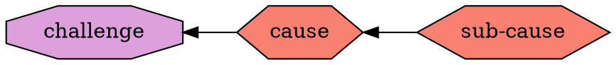
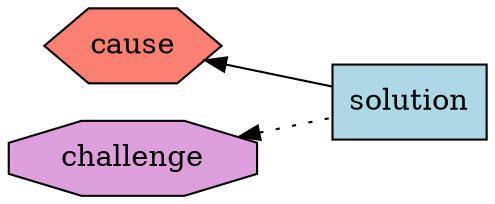
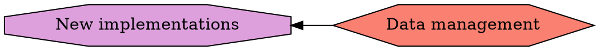
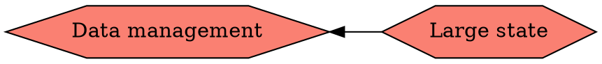
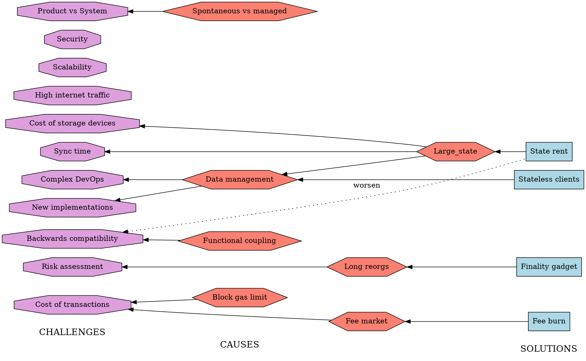

# Ethereum 1x Definition (part 2)

## Methodology (continuation from part 1)
In part 1, we define agents, their contributions to the Ethereum system, and their challenges. This part deals with causes for these challenges, as well as the solution that have been proposed for these causes.

### Causes
We try to understand the main causes of each challenge. Where it adds to understanding, we talk about sub-causes

### Solutions
Proposed solutions should be targeted at the causes but may have side-effects (some solutions may be causes for other challenges, though perhaps less critical than the ones they are trying to address). These side effects are shown as dotted lines.

## Summary of challenges
Here we summarise the challenges we have identified in the part 1.
1. Long time to sync a new node
2. Cost of storage devices
3. High internet traffic
4. Complex DevOps to run nodes
5. Balancing between updating rules and maintaining backwards compatibility
6. Balacing between improving client implementations as product and updating the rules of Ethereum
7. Difficulty of writing new implementations
8. Limited transaction throughput
9. Difficulty of assessing safety of some transactions (to smart contracts)
10. Difficulty in estimating cost of a transaction

## Description of challenges

This section is to be filled

## Prioriting of challenges
Although any prioritisation of challenges would appear subjective, the approach is to compare the impact of challenges not being met. For example, if the challenge **Long time to sync a new node** is not met, and the sync time keeps growing, we can predict that at some point in the future, the network will become really difficult or impossible to join for the new operators. Although this will not immediately cause the system to fall, it will make it less resilient in the case of some node operators disappering.

## Summary of causes
Here we summarise the causes for the challenges:
1. Large (and growing) state
2. Snapshot sync algorithm implementation deficiencies - e.g. sensitivity to network latencies (how much slower alrorithm performs with an increase in latency) and traffic usage efficiency (how much more data algorithm transmits with an increase of state size)
3. Increasingly intricate data management that an Ethereum node needs to perform (e.g. data caching strategies, partioning data by usage type).
4. Functional coupling on implementation level. Example - persistent storage of state as a merkle particia tree, which couples logical structure needed to compute state root, and physical structure needed to store the state. Such coupling makes it harder to switch to binary merkle tree for hashing the state.
5. Functional coupling on "protocol" level. Example - notion of gas couples two functions (charge for resource usage and restriction of callbacks and recursion) that are getting in conflict with each other.
6. EVM design favours expressiveness over tractability.
7. Transaction fee market behaves suboptimally when blocks are at the block gas limit (which is currently almost always).
8. Possibility of long chain reorgs.

## Description of causes

### Large (and growing) state
Ethereum's state is a data structure that needs to be implicitely constructed, stored and accessed in order to be able to execute arbitrary transactions. This is because a transaction may theoretically access any item in the current state. The state size grew beyond the capacity of RAM (Random Access Memory) on average computers some time in 2017. After that point, RAM could only be used to cache certain portions of the state, whereas the entirety of the state reside on persitent storage devices. Any caching strategy apart from keeping a random portion of the accessible state, would be vulnerable to attack. Therefore, assuming that random caching strategy, the cache hit ratio would very close to the ratio of size of the cache to the size of the entire state. And cache miss would mean accessing devices with much higher latency.
Due to the further growth of the state, it became impractical to use HDD (Hard Disk Drives - storage devices with mechanically spinning disks) for storage of the state, due to the high latency of the access. Even SDD (Solid State Drives) are on the edge of being appropriate. Devices such as NVM (Non Volative Memory) are now required to ensure good performance. However, such devices are still relatively expensive and their price proportional to capacity ($/Gb) is highly non-linear after certain point.
State size also places a significant burden on the new participants in the Ethereum network. Most popular way of joining the network at this moment is so-called "snapshot syncronisation". It is the process in which the new joiner downloads the entire state from the existing peers. The sheer size of the state puts a high demand on the bandwidth quality. Dealing the network latencies requires sophisticated algorithms for downloading. And the ever-changing nature of the state (it keeps changing during the download) either puts snapshot sync at odds with state history pruning, or requires even more sophisticated algorithms for the downloading of the state.

## Snapshot sync algorithm implementation deficiencies

## Summary of solutions
1. State rent
2. Stateless clients
3. Content Distribution Networks (CDN) to store blocks and/or state
4. Decoupling of two functions of gas
5. Burning part of the transaction fees (EIP-1559)
6. Flat data layout (like in Turbo-Geth)
7. Introducing WASM engine
8. Finality gadget to link Ethereum 1x to the Beacon chain
9. Upgrade of the Proof Of Work alorithm (ProgPOW)
10. State management component (interface design)

#### Data management (cause)
The hardest part of a mainnet capable implementation seems to be data management. Ethereum node needs to transmit, process and store large amounts of data. To do so efficiently, it needs non-trivial techniques. Such techniques, however, are currently not considered in Ethereum specification documents or other literature.

#### Large state (sub-cause)

#### Functional coupling (cause)
In the design of Ethereum, there some crucial concepts with double of tripple functions. First example: gas is used as charge for resources, as well as means of restricting callbacks and recursion depth. Second example: nonce of accounts is used for both replay protection and as input for generating of the contract addresses. Third example (though this is a prevalent implementation choice rather than a requirement of the specification): particia merkle tree is used for both defining what the state root hash is, and for storing data. Functional coupling makes the design inflexible and causes issues when something about the concept needs to be changed. For example, changing gas cost of some operations, like reduction for `SSTORE` and increase for `SLOAD` clashes with the concept of call stipend, which is part of the restricting function of gas.

#### Spontaneous voluntary contributions vs Managed development (cause)
By "spontaneous voluntary contributions" we understand contributions to core implementation by people who are not explicitely asked to do the work, but decide to do it, because they found it interesting and/or important.
By "managed development" we understand development in the core implementations that are directed by some leadership, according to some implementation plan.
Both ways of development have their pros and cons. It seems that in the current circumstances we mainly rely on the spontaneous voluntary contributions and that seems to leave important gaps and technical debt.

## Entire diagram

## TODOs
- [ ] Discuss and correct methodology, wording, and content (specically the challenges)
- [ ] Levels of criticality for challenges, perhaps expressed by colours
- [ ] Add remaining open projects to the solutions
- [ ] Place correct hyperlinks on all the nodes in the diagram
