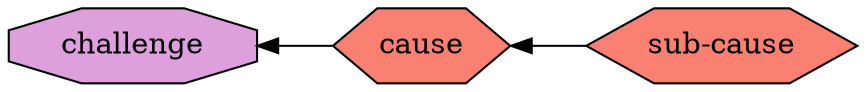
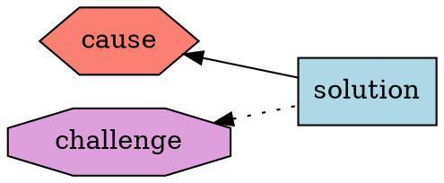
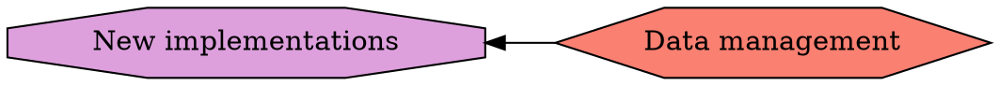
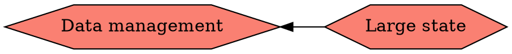
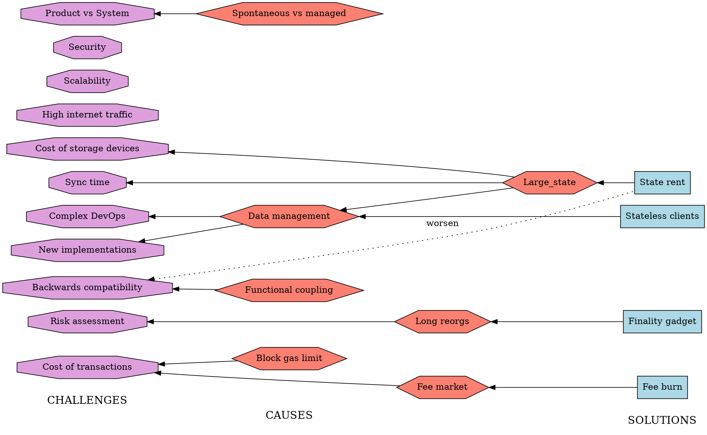

# Ethereum 1x Definition (part 2)

### Causes
We try to understand the main causes of each challenge. Where it adds to understanding, we talk about sub-causes

### Solutions
Proposed solutions should be targeted at the causes but may have side-effects (some solutions may be causes for other challenges, though perhaps less critical than the ones they are trying to address)

#### Data management (cause)
The hardest part of a mainnet capable implementation seems to be data management. Ethereum node needs to transmit, process and store large amounts of data. To do so efficiently, it needs non-trivial techniques. Such techniques, however, are currently not considered in Ethereum specification documents or other literature.

#### Large state (sub-cause)

#### Functional coupling (cause)
In the design of Ethereum, there some crucial concepts with double of tripple functions. First example: gas is used as charge for resources, as well as means of restricting callbacks and recursion depth. Second example: nonce of accounts is used for both replay protection and as input for generating of the contract addresses. Third example (though this is a prevalent implementation choice rather than a requirement of the specification): particia merkle tree is used for both defining what the state root hash is, and for storing data. Functional coupling makes the design inflexible and causes issues when something about the concept needs to be changed. For example, changing gas cost of some operations, like reduction for `SSTORE` and increase for `SLOAD` clashes with the concept of call stipend, which is part of the restricting function of gas.

#### Spontaneous voluntary contributions vs Managed development (cause)
By "spontaneous voluntary contributions" we understand contributions to core implementation by people who are not explicitely asked to do the work, but decide to do it, because they found it interesting and/or important.
By "managed development" we understand development in the core implementations that are directed by some leadership, according to some implementation plan.
Both ways of development have their pros and cons. It seems that in the current circumstances we mainly rely on the spontaneous voluntary contributions and that seems to leave important gaps and technical debt.

## Entire diagram

## TODOs
- [ ] Discuss and correct methodology, wording, and content (specically the challenges)
- [ ] Levels of criticality for challenges, perhaps expressed by colours
- [ ] Add remaining open projects to the solutions
- [ ] Place correct hyperlinks on all the nodes in the diagram
