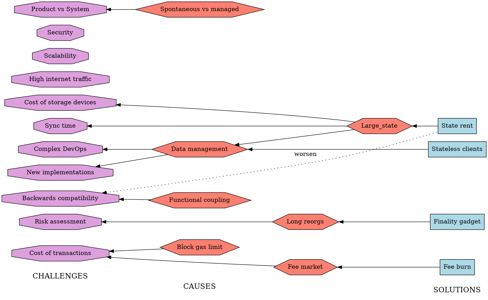

# Ethereum 1x Definition (part 2 diagram WIP)

The diagram for the part 2 is moved here for rework

## TODOs
- [ ] Discuss and correct methodology, wording, and content (specically the challenges)
- [ ] Levels of criticality for challenges, perhaps expressed by colours
- [ ] Add remaining open projects to the solutions
- [ ] Place correct hyperlinks on all the nodes in the diagram
